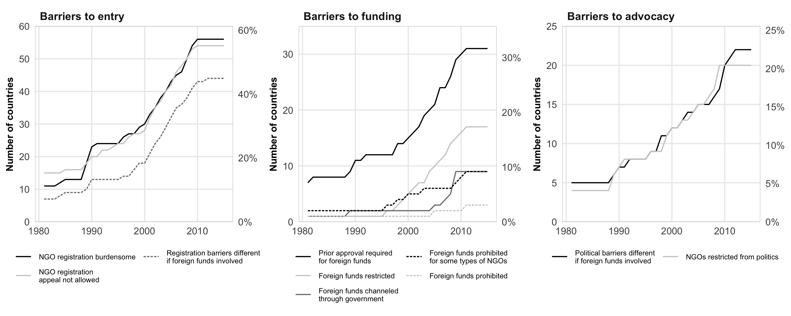

# Anti-NGO legal barriers

This repository contains the code for plotting the cumulative number of 98 countries that have imposed some form of anti-NGO legislation between 1980 and 2013. The data comes from [the replication materials](https://darinchristensen.com/replication/JoD_Replication.zip) for Darin Christensen and Jeremy Weinstein, ["Defunding Dissent,"](https://www.journalofdemocracy.org/article/defunding-dissent-restrictions-aid-ngos) *Journal of Democracy* 24, vol. 2 (2013). The acronym DCJW used throughout stands for Darin Christensen and Jeremy Weinstein.

# Repository contents

Specifically, here's what's in this repository:

- `01_clean-data.R`: R script that takes the original DCJW replication data and converts it into a cleaner, tidier format for analysis
- `02_plot-data.R`: R script that makes the plot
- `output/all_barriers.[pdf/png]`: PDF and PNG versions of the plot
- `data_original/DCJW_NGO_Laws.xlsx`: Original replication data from the DCJW paper
- `data_original/dcjw_questions.csv`: Hand-typed lookup table that matches raw question names (e.g. `q_1a`) to human readable names (e.g. `const_assoc` and "Constitutional associational rights")
- `data_clean/dcjw_clean.[csv/xlsx]`: Cleaned up version of the original Excel file with indexes for overal counts of entry, funding, and advocacy barriers
- `data_clean/dcjw_plot.[csv/xlsx]`: Data with cumulative counts of barriers, in long format for plotting with R
